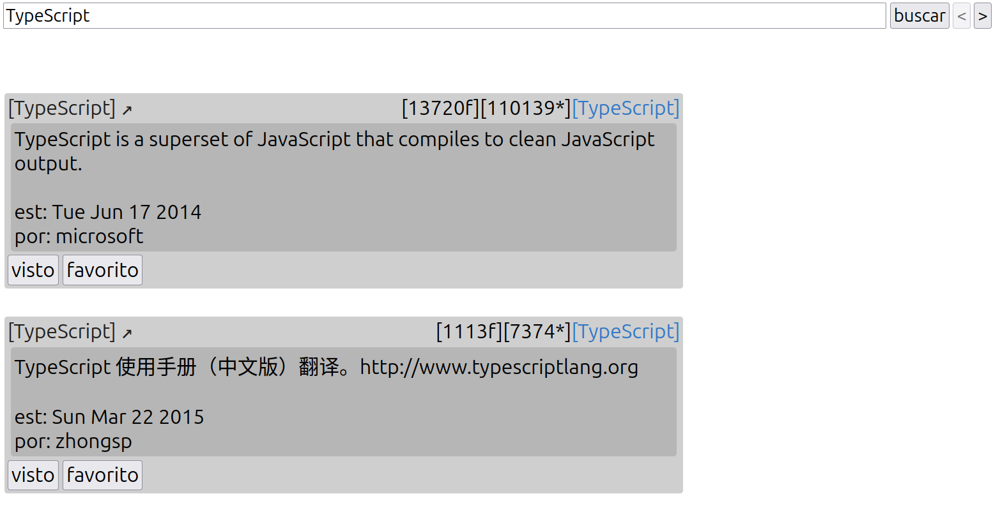

Este é um programa frontend feito com TypeScript de busca de repositórios do GitHub, mostrando os resultados de forma detalhada, mas concisa (estrelas, forks, descricao, lingua primária...). 
Foi o meu primeiro projeto de typescript. 

### Uso:
Coloque o termo de busca na barra de input e aperte o botão "buscar" para iniciar a pesquisa. 
Os botões de seta ao lado de "buscar" servem para trocar de página (caso a busca resulte em mais de 10 repositórios). 
Dentro de uma busca (definida pelo aperto do botão "buscar"), é possível marcar um repositório como favorito e/ou visto, facilitando navegação. Trocar de página não desmarcará um repositório, mas uma nova busca fará o programa esquecer as marcações.

### Para executar:

Necessário: Node.js (v18+)  
Necessário: npm   
Necessário: Vá para [github/personal-access-tokens](https://github.com/settings/personal-access-tokens) e crie um novo token de acesso com permissão para ver todos os repositórios. Renomeie o arquivo src/configt.ts para src/config.ts e insira a chave recém criada na variavel "chave_github":

    src/config.ts:

    export const chave_github: string = "CHAVE-AQUI";
                                             ^
                        como habilmente indicado, a chave vai aqui.

Por fim, para executar:

    npm run this

    OU

    npx tsc --outDir build
    npx serve .

    na raiz do projeto.